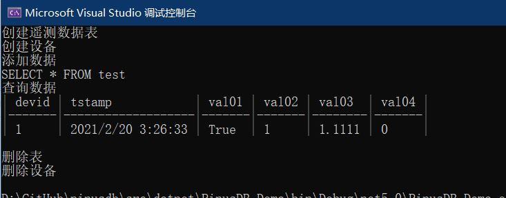

---

# PinusDB.Data

为国产松果时序数据库(pinusdb)实现的标准ADO.Net 的数据访问接口。 

PinusDB.Data 不同于[官方提供的 .Net SDK](https://gitee.com/pinusdb/pinusdb/blob/master/doc/pinusdb_dotnet_sdk.md)  , 本库符合ADO.Net标准。


---

[](https://ci.appveyor.com/project/MaiKeBing/pinusdb-data)
[](https://github.com/maikebing/PinusDB.Data/blob/master/LICENSE)

| NuGet名称    | 版本|下载量| 说明                                                     |
| ----------- | --------  | --------  | ------------------------------------------------------------ |
| PinusDB.Data |[](https://www.nuget.org/packages/PinusDB/) | |ADO.Net Core 基础组件
| PinusDB.HealthChecks |[](https://www.nuget.org/packages/PinusDB.HealthChecks/)  |  | 供Asp.Net Core 使用的健康检查组件


示例如下:

```c#
   var builder = new PinusConnectionStringBuilder()
                {
                    Server = "127.0.0.1",
                    Username = "sa",
                    Password = "future",
                    Port = 8105
                };
                using (var connection = new PinusConnection(builder.ConnectionString))
                {
                    connection.Open();
                    Console.WriteLine("创建遥测数据表", connection.CreateCommand(
                        @" CREATE TABLE test (  devid bigint,                  tstamp datetime, val01 bool, val02 bigint, val03 double, val04 real2 )").ExecuteNonQuery());
                    Console.WriteLine("创建设备", connection.CreateCommand(@"INSERT INTO sys_dev(tabname, devid) VALUES('test',1)").ExecuteNonQuery());
                    Console.WriteLine("添加数据", connection.CreateCommand(@"INSERT INTO test(devid,tstamp,val01,val02,val03) VALUES(1, now(), true, 1, 1.1111)").ExecuteNonQuery());
                    var cmd_select = connection.CreateCommand();
                    cmd_select.CommandText = $"SELECT * FROM test";
                    var reader = cmd_select.ExecuteReader();
                    Console.WriteLine(cmd_select.CommandText);
                    Console.WriteLine("查询数据");
                    ConsoleTableBuilder.From(reader.ToDataTable()).WithFormat(ConsoleTableBuilderFormat.MarkDown).ExportAndWriteLine();
                    Console.WriteLine("");
                    Console.WriteLine("删除表", connection.CreateCommand($"DROP TABLE test").ExecuteNonQuery());
                    Console.WriteLine("删除设备", connection.CreateCommand($"DELETE FROM sys_dev WHERE tabname='test'").ExecuteNonQuery());
                    connection.Close();
                }
```


 
